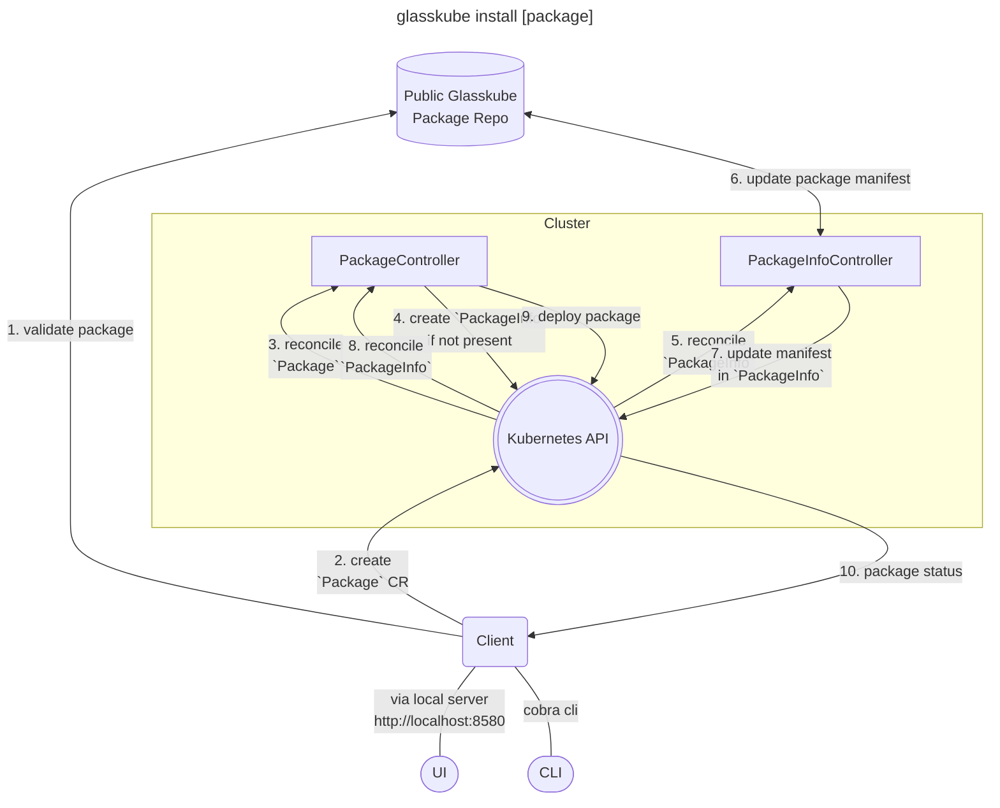

[](https://github.com/glasskube/glasskube)
[](https://opensource.org/licenses/Apache-2.0)
[](https://glasskube.dev/docs/?utm_source=github)
[](https://discord.gg/SxH6KUCGH7)

[](https://x.com/intent/follow?screen_name=glasskube)

<br>
<div align="center">
  <a href="https://glasskube.dev?utm_source=github">
    
  </a>

<h3 align="center">🧊 The missing Package Manager for Kubernetes 📦</h3>

  <p align="center">
    <a href="https://glasskube.dev/docs/getting-started/install?utm_source=github"><strong>Getting started »</strong></a>
    <br> <br>
    <a href="https://glasskube.dev?utm_source=github"><strong>Explore our website »</strong></a>
    <br>
    <br>
    <a href="https://github.com/glasskube" target="_blank">GitHub</a>
    .
    <a href="https://hub.docker.com/u/glasskube" target="_blank">Docker Hub</a>
    .
    <a href="https://artifacthub.io/packages/search?org=glasskube" target="_blank">Artifact Hub</a>
    .
    <a href="https://www.linkedin.com/company/glasskube/" target="_blank">LinkedIn</a>
    . 
     <a href="https://x.com/intent/follow?screen_name=glasskube" target="_blank">Twitter / X</a>
  </p>
</div>

<hr>


## ⭐️ Why Glasskube?

Using **traditional package managers** or applying manifests directly can be **super confusing** and doesn't scale.
Therefore, Glasskube will help you to **install your favorite Kubernetes packages** using the **Glasskube UI** for reduced complexity and increased transparency.
We are also providing a **brew inspired CLI** for advanced users. Our **packages are dependency aware**, as you would expect from a package manager.
Designed as a cloud native application, so you can follow your **GitOps approach**.

## ✨ Features

- 💡 **Streamlined UI and CLI Experience**:
  <br> We've stripped away unnecessary complexities, providing a simple yet powerful user interface and command-line interface for easy package management.
- 🔄 **Automated Updates**:
  <br> Glasskube ensures your Kubernetes packages and apps are always up-to-date, minimizing the manual effort required for maintenance.
- 🤝 **Dependency Awareness**:
  <br> We understand the interconnected nature of Kubernetes packages. Glasskube intelligently manages dependencies.
- 🛠️ **GitOps Ready** with ArgoCD or Flux:
  <br> Seamlessly integrate Glasskube into your GitOps workflow with support for popular tools like ArgoCD or Flux.
- 📦 **Central Package Repository**:
  <br> Keep track of all your packages in one central repository, which a [planned](https://glasskube.dev/roadmap/?utm_source=github) feature for custom repositories.
- 🔍 **Cluster Scan** ([planned](https://glasskube.dev/roadmap/?utm_source=github)):
  <br> Introducing the Cluster Scan feature in a future version, which allows you to detect packages in your cluster, providing valuable insights for better management and upgrade paths.
- 🔐 **Version Pinning** ([planned](https://glasskube.dev/roadmap/?utm_source=github)):
  <br> With a future version, Glasskube will introduce Version Pinning, gives you control over your package versions.

## 🗄️ Table Of Contents

- [Quick Start](https://github.com/glasskube/#-quick-start)
- [Supported Tools](https://github.com/glasskube/glasskube#-supported-tools)
- [How to install your first package](https://github.com/glasskube/glasskube#-how-to-install-you-first-package)
- [Architecture Diagram](https://github.com/glasskube/glasskube#architecture-diagram)
- [Need help?](https://github.com/glasskube/glasskube#-need-help)
- [Related projects](https://github.com/glasskube/glasskube#-related-projects)
- [How to Contribute](https://github.com/glasskube/glasskube#-how-to-contribute)
- [Supported by](https://github.com/glasskube/glasskube#-supported-by)

## 🚀 Quick Start - Install your first package in less than 5 minutes.

Install Glasskube via [Homebrew](https://brew.sh/):

```bash
brew tap glasskube/glasskube
brew install glasskube
```

Start the package manager:

```bash
glasskube serve
```

Open [`http://localhost:8580`](http://localhost:8580) and explore available packages.

## 📦 Supported Packages

- Cert Manager [`cert-manager/cert-manager`](https://github.com/cert-manager/cert-manager)
- Ingress-NGINX Controller [`kubernetes/ingress-nginx`](https://github.com/kubernetes/ingress-nginx)
- Kubernetes Dashboard [`kubernetes/dashboard`](https://github.com/kubernetes/dashboard)

### Coming Soon

<!---x-release-please-start-version-->
In the next versions you will be able to install more packages like the [Kube-Prometheus-Stack](https://github.com/prometheus-community/helm-charts/tree/main/charts/kube-prometheus-stack), [Velero](https://github.com/vmware-tanzu/velero) and the [CloudNativePG](https://github.com/cloudnative-pg/cloudnative-pg]). With v0.1.0 you will also be able to install apps like [GitLab](https://gitlab.com/gitlab-org/gitlab), [Keycloak](https://github.com/keycloak/keycloak) or [Hashicorp Vault](https://github.com/hashicorp/vault) with the [Glasskube Apps Operator](https://github.com/glasskube/operator/). You can find the full list and release schedule in our [roadmap](https://glasskube.dev/roadmap/#packages-and-apps-schedule?utm_source=github)
<!---x-release-please-end-version-->

> Can't find a package or want your app included in the list? We are always adding new supported packages & apps,
> so just join us on [Discord](https://discord.gg/SxH6KUCGH7) or open up a new issue and let us know what is missing!

## 🎬 How to install you first package

[](https://asciinema.org/a/k19wlsoX5Mr3raY6ro13imyNo)

## Architecture Diagram


## ☝️ Need Help?

If you encounter any problems, we will be happy to support you wherever we can on our [Discord](https://discord.gg/SxH6KUCGH7).
For bugs, issues or feature requests fee free to [open an issue](https://github.com/glasskube/glasskube/issues/new/choose).
We are happy to assist you with anything related to the project.

## 📎 Related Projects

- Glasskube Apps Operator [`glasskube/operator`](https://github.com/glasskube/operator/)

## 🤝 How to Contribute

See [the contributing guide](CONTRIBUTING.md) for detailed instructions.

## 🤩 Thanks to all our Contributors

Thanks to everyone, that is supporting this project. We are thankful, for evey contribution, no matter its size!

<a href="https://github.com/glasskube/glasskube/graphs/contributors">
  
  
</a>

## 📘 License

The Glasskube is licensed under the Apache 2.0 license. For more information check the [LICENSE](https://github.com/glasskube/glasskube/blob/main/LICENSE) file for details.
