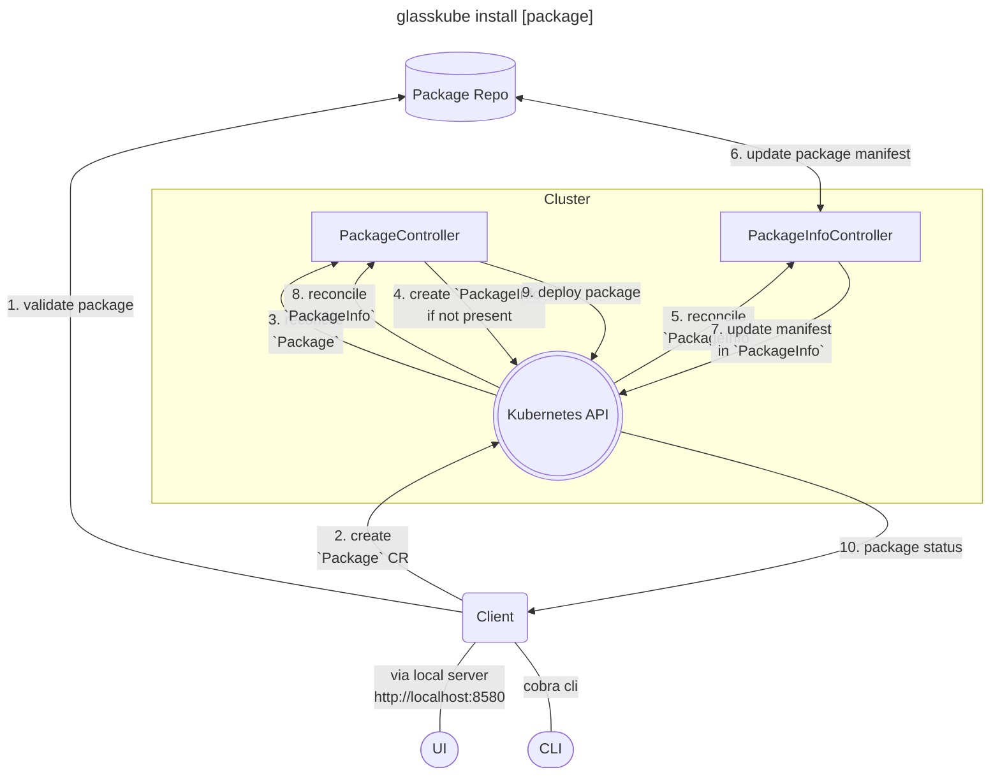

[](https://github.com/glasskube/glasskube)
[](https://opensource.org/licenses/Apache-2.0)
[](https://glasskube.dev/docs/?utm_source=github)
[](https://discord.gg/SxH6KUCGH7)
[](https://github.com/glasskube/glasskube/releases)
[](https://landscape.cncf.io/?item=app-definition-and-development--application-definition-image-build--glasskube)
[](https://pkg.go.dev/github.com/glasskube/glasskube)
[](https://goreportcard.com/report/github.com/glasskube/glasskube)

<br>
<div align="center">
  <a href="https://glasskube.dev?utm_source=github">
    
  </a>
  

<h3 align="center">🧊 The next generation Package Manager for Kubernetes 📦 (Beta Version)</h3>

  <p align="center">
    <a href="https://glasskube.dev/docs/getting-started/install?utm_source=github"><strong>Getting started »</strong></a>
    <br> <br>
    <a href="https://glasskube.dev?utm_source=github"><strong>Explore our website »</strong></a>
    <br>
    <br>
    <a href="https://github.com/glasskube" target="_blank">GitHub</a>
    .
    <a href="https://hub.docker.com/u/glasskube" target="_blank">Docker Hub</a>
    .
    <a href="https://artifacthub.io/packages/search?org=glasskube" target="_blank">Artifact Hub</a>
    .
    <a href="https://www.linkedin.com/company/glasskube/" target="_blank">LinkedIn</a>
    . 
     <a href="https://x.com/intent/follow?screen_name=glasskube" target="_blank">Twitter / X</a>
  </p>
</div>
<br>
<br>
<div align="center">
<a href="https://www.producthunt.com/posts/glasskube" target="_blank">
  
</a>
</div>
<br>
<hr>


## 📦 What is Glasskube?

Glasskube is the **next generation Kubernetes package manager**, now available in its `beta version`. Glasskube empowers you to effortlessly **install, upgrade, configure, and manage** your Kubernetes cluster packages, all while streamlining repetitive and cumbersome maintenance tasks. We're excited to roll out the beta release and invite all users to test it out! **Your feedback is incredibly valuable to us** as we aim to shape Glasskube into `the best Kubernetes package manager out there`. So go ahead, dive in, play around, and shoot us your thoughts!


## ⭐️ Why Glasskube?

Using **traditional package managers** or applying manifests directly can be **super confusing** and doesn't scale.
Therefore, Glasskube will help you to **install your favorite Kubernetes packages** using the **Glasskube UI** for reduced complexity and increased transparency.
We are also providing a **brew inspired CLI** for advanced users. Our **packages are dependency aware**, as you would expect from a package manager.
Designed as a cloud native application, so you can follow your **GitOps approach**.

## ✨ Features

- 💡 **Streamlined UI and CLI Experience**:
  <br> We've stripped away unnecessary complexities, providing a simple yet powerful user interface and command-line interface for easy package management.
- 🔄 **Automated Updates**:
  <br> Glasskube ensures your Kubernetes packages and apps are always up-to-date, minimizing the manual effort required for maintenance.
- 🤝 **Dependency Awareness**:
  <br> We understand the interconnected nature of Kubernetes packages. Glasskube intelligently manages dependencies.
- 🛠️ **GitOps Ready** with ArgoCD or Flux:
  <br> Seamlessly integrate Glasskube into your GitOps workflow with support for popular tools like ArgoCD or Flux.
- 📦 **Central Package Repository**:
  <br> Keep track of all your packages in one central repository, with a [planned](https://glasskube.dev/roadmap/?utm_source=github) feature for custom repositories.
- 🔍 **Cluster Scan** ([planned](https://glasskube.dev/roadmap/?utm_source=github)):
  <br> Introducing the Cluster Scan feature in a future version, which allows you to detect packages in your cluster, providing valuable insights for better management and upgrade paths.
- 🔐 **Version Pinning**:
  <br> With a future version, Glasskube will introduce Version Pinning, giving you control over your package versions.

## 🗄️ Table Of Contents

- [Quick Start](https://github.com/glasskube/#-quick-start)
- [Supported Tools](https://github.com/glasskube/glasskube#-supported-tools)
- [How to install your first package](https://github.com/glasskube/glasskube#-how-to-install-you-first-package)
- [Architecture Diagram](https://github.com/glasskube/glasskube#architecture-diagram)
- [Need help?](https://github.com/glasskube/glasskube#-need-help)
- [Related projects](https://github.com/glasskube/glasskube#-related-projects)
- [How to Contribute](https://github.com/glasskube/glasskube#-how-to-contribute)
- [Supported by](https://github.com/glasskube/glasskube#-supported-by)

## 🚀 Quick Start - Install the Beta Version.

You can install Glasskube via [Homebrew](https://brew.sh/):

```bash
brew install glasskube/tap/glasskube
```

For other installation options check out our [install guide](https://glasskube.dev/docs/getting-started/install).

Once the CLI is installed, the first step is to install the necessary components in your cluster. To do that, run
```sh
glasskube bootstrap
```

After successfully bootstrapping your cluster, you are ready to start the package manager UI:

```bash
glasskube serve
```

This command will open [`http://localhost:8580`](http://localhost:8580) in your default browser. 
Congratulations, you can now explore and install all our available packages! 🎉

## 📦 Supported Packages

- Cert Manager [`cert-manager/cert-manager`](https://github.com/cert-manager/cert-manager)
- Cyclops [`cyclops-ui/cyclops`](https://github.com/cyclops-ui/cyclops)
- Ingress-NGINX Controller [`kubernetes/ingress-nginx`](https://github.com/kubernetes/ingress-nginx)
- Keptn [`keptn/lifecycle-toolkit`](https://github.com/keptn/lifecycle-toolkit)
- Kubernetes Dashboard [`kubernetes/dashboard`](https://github.com/kubernetes/dashboard)

### Coming Soon

In the next versions you will be able to install more packages like the [Kube-Prometheus-Stack](https://github.com/prometheus-community/helm-charts/tree/main/charts/kube-prometheus-stack), [Velero](https://github.com/vmware-tanzu/velero) and the [CloudNativePG](https://github.com/cloudnative-pg/cloudnative-pg). With v1.0.0 you will also be able to install apps like [GitLab](https://gitlab.com/gitlab-org/gitlab), [Keycloak](https://github.com/keycloak/keycloak) or [Hashicorp Vault](https://github.com/hashicorp/vault) with the [Glasskube Apps Operator](https://github.com/glasskube/operator/). You can find the full list and release schedule in our [roadmap](https://glasskube.dev/roadmap/#packages-and-apps-schedule?utm_source=github)

> Can't find a package or want your app included in the list? We are always adding new supported packages & apps,
> so just join us on [Discord](https://discord.gg/SxH6KUCGH7) or open up a new issue and let us know what is missing!

## 🎬 How to install you first package


## Architecture Diagram


## ☝️ Need Help or Want to Provide Feedback?

If you encounter any problems, we will be happy to support you wherever we can on our [Discord](https://discord.gg/SxH6KUCGH7).
For bugs, issues or feature requests fee free to [open an issue](https://github.com/glasskube/glasskube/issues/new/choose).
We are happy to assist you with anything related to the project.

## 📎 Related Projects

- Glasskube Apps Operator [`glasskube/operator`](https://github.com/glasskube/operator/)

## 🤝 How to Contribute to Glasskube Beta

Your feedback is invaluable to us as we continue to improve Glasskube. If you'd like to contribute, consider trying out the beta version, reporting any issues, and sharing your suggestions. See [the contributing guide](CONTRIBUTING.md) for detailed instructions on how you can contribute.

## 🤩 Thanks to all our Contributors

Thanks to everyone, that is supporting this project. We are thankful, for every contribution, no matter its size!

<a href="https://github.com/glasskube/glasskube/graphs/contributors">
  
</a>

## 👾 Activity


## 📘 License

The Glasskube is licensed under the Apache 2.0 license. For more information check the [LICENSE](https://github.com/glasskube/glasskube/blob/main/LICENSE) file for details.
