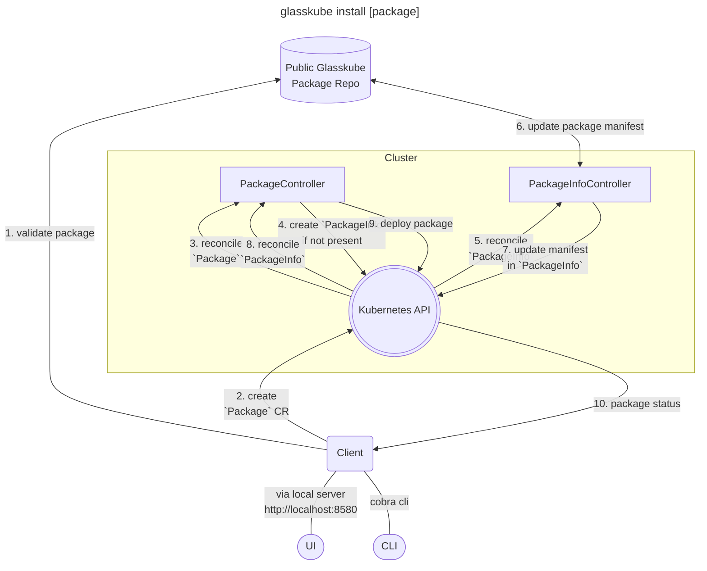

import Install from '../../src/partials/_install.mdx';

Glasskube is open-source on GitHub - Support us by leaving a star: [⭐ `glasskube/glasskube` ⭐](https://github.com/glasskube/glasskube/)

*The aim of this post is to share our technical preview of how a cloud native package manager could work and what challenges need to be solved.*

## The missing package manager for Kubernetes - Introducing Glasskube

Package Management on Kubernetes is one of the most pressing issues in the Cloud Native community.
A concept which is widely known from other ecosystems like desktop and mobile computing has yet not been realized for cloud computing.
On Android and iOS for example millions of developers publish their packages via the Play store or App Store to its users.
The package manager also makes sure all users receive the latest version published by the developer and the developer receives
crash reports and user feedback as a return to improve their applications,
but as a cloud native developer there is no package manager you can rely on - yet.

Our first release (v0.0.1) already features a working prototype that can install basic packages, but a lot of challenges still need to be solved.

### A cloud native architecture

Glasskube is designed as a cloud native application itself.
Featuring an easy to install client that comes with a graphical user interface and autocompletion for your favorite shell.

At the heart of the Glasskube package ecosystems lies our central package registry which holds the package manifests.
The Glasskube package operator syncs the latest manifest into the cluster and makes sure it will be updated as soon as a new manifest is available.

### Challenges that need to be solved

We already covered some our next features in our [public roadmap](https://glasskube.dev/roadmap), but I also like to shortly speak about broader challenges.

#### Kubernetes version compatibility

Kubernetes releases minor versions every 4 months which often comes with new api versions. So package authors need to adapt their packages to the new api versions.
Kubernetes is designed in a way that often multiple api versions are implemented in specific release of Kubernetes, so packages often work with a broader range
of Kubernetes versions.
These compatible versions are often only documented in the package distributors' changelog.
Glasskube aims to incorporate this kind of metadata in combination with automatic checks from tools like [kube-no-trouble](https://github.com/doitintl/kube-no-trouble)
or [Pluto](https://github.com/FairwindsOps/pluto).

The user should not need to manually check all packages for compatability as well as package developers should get feedback if they are not compatible with the latest api versions.

#### Package dependencies

Cloud native applications often work together as there are already quite a few packages that are present in most clusters anyway - like cert-manager, Ingress controller or
database operators. Due to the lack of a package manager and ecosystem these dependencies are still often only documented in the Getting started section of an application.

In an ideal world a developer can just refer to a dependency as a dependency and the package manager makes sure that all these prerequisites are fulfilled.

#### Testing

In order to support multiple kubernetes versions, dependencies and packages Glasskube need to build massive automated testing infrastructure for all packages in its central package repository.

#### Feedback and package quality

Similar to other package managers user feedback is highly important to share problems and work together on solutions.

## Glasskube and Helm

Glasskube is no replacement for Helm. Helm has its strengths in configuring releases through templating and having the ability to perform upgrades and rollbacks.

Glasskube focuses more on the administrator that needs to only install and kustomize (pun intended ;-) ) a single application, but needs to make sure multiple
package stay up-to-date and secure through multiple Kubernetes releases and breaking changes.

## Getting started

Follow our [Getting Started guide](https://glasskube.dev/docs/getting-started/install) to install glasskube and install your first package.

<Install/>

## Release Notes

All release notes can be found on GitHub: https://github.com/glasskube/glasskube/releases/tag/v0.0.1

## Get involved

The simplest way to get involved is to tackle on of our [open Issues](https://github.com/glasskube/glasskube/issues)
or join our [Discord](https://discord.gg/SxH6KUCGH7).

**If you are a cloud native developer, please [submit your package](https://github.com/glasskube/glasskube/discussions/90)**
