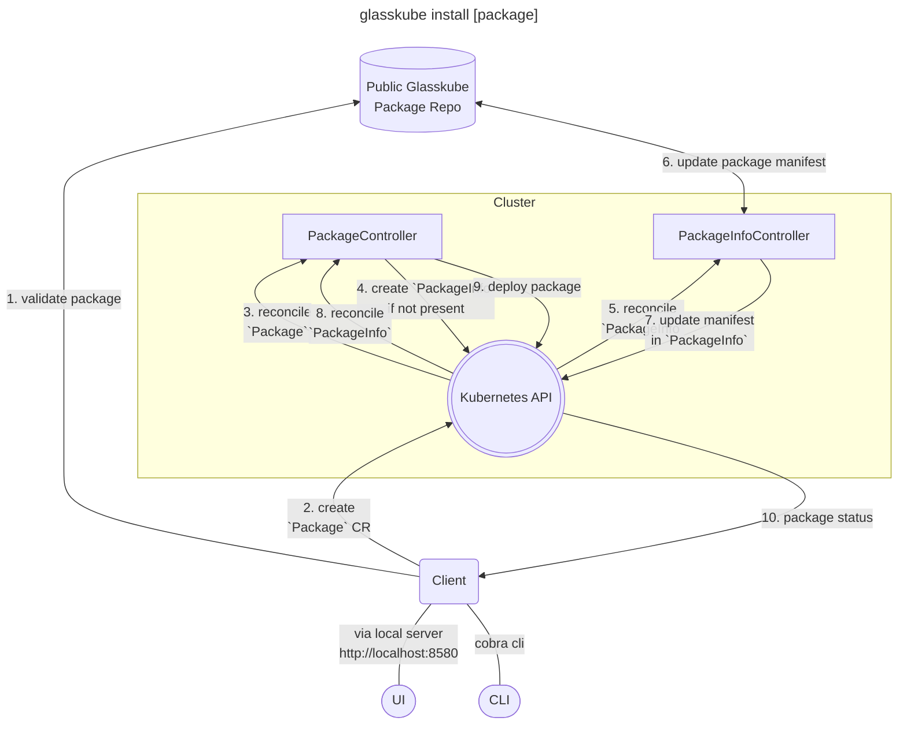

import Install from '../../src/partials/_install.mdx';

*The aim of this post is to share our technical preview of how a cloud native package manager could work and what challenges need to be solved.*

<!-- truncate -->

Glasskube is fully open-source. Support us by leaving a star: [⭐ `glasskube/glasskube` ⭐](https://github.com/glasskube/glasskube/)

## Introducing Glasskube — The next generation Package Manager For Kubernetes

Package Management on Kubernetes is one of the most pressing issues in the Cloud Native community.
A concept which is widely known from other ecosystems like desktop and mobile computing has yet not been realized for cloud computing.
For example on Android and iOS, millions of developers publish their packages in the Play Store or App Store to reach their users.
The package manager also makes sure all users receive the latest version published by the developer and the developer receives
crash reports and user feedback as a return to improve their applications,
but as a cloud native developer there is no package manager you can rely on — yet.

Our first release (v0.0.1) already features a working prototype that can install basic packages, but a lot of challenges still need to be solved.

### A cloud native architecture

Glasskube itself is designed as a cloud native application.
Featuring an easy to install client that comes with a graphical user interface and autocompletion for your favorite shell.

At the heart of the Glasskube package ecosystem lies our central package registry which holds the package manifests.
In a future version we also plan to support 3rd party registries and the possibility to use multiple registries in a cluster.

The Glasskube package operator syncs the latest manifest into the cluster and makes sure it will be updated as soon as a new manifest is available.

### Challenges that need to be solved

We already covered some our upcoming features in our [public roadmap](/roadmap), but I would also like to take this opportunity to shortly speak about broader challenges.

#### Kubernetes version compatibility

Kubernetes releases minor versions every 4 months, which often come with new API versions. Package authors need to adapt their packages to these changes.
In Kubernetes, a particular release might include more than one API version of a resource, so that packages can be compatible with a broader range of Kubernetes versions.
These compatible versions are often only documented in the package distributors' changelog.
Glasskube aims to incorporate this kind of metadata in combination with automatic checks from tools like [kube-no-trouble](https://github.com/doitintl/kube-no-trouble)
or [Pluto](https://github.com/FairwindsOps/pluto).

The user should not be required to drudgingly check all packages for compatibility and package developers should get feedback if their package is not compatible with the latest API versions.

#### Package dependencies

Cloud native applications often interoperate and there are some packages that can be found in almost every Kubernetes cluster. For example: cert-manager, Ingress controllers or
database operators. Due to the lack of a package manager and ecosystem these dependencies are still often only documented in the Getting started section of an application.

In an ideal world a package author could simply specify a dependency of their package and the package manager ensures that all these prerequisites are fulfilled.

#### Testing

In order to support multiple Kubernetes versions, dependencies and packages Glasskube needs to build massive automated testing infrastructure for all packages in its central package registry.

#### Feedback and package quality

As seen in other package managers like the [arch user repository](https://aur.archlinux.org/) or the Play Store and App Store
users' feedback and reviews help other users to decide between different packages.
Also, application developer will incorporate users' feedback to gain popularity and better ratings in the package manager.

## Glasskube and Helm

Glasskube is no replacement for Helm. Helm has its strengths in configuring releases through templating and having the ability to perform upgrades and rollbacks.

Glasskube is laser focused on the administrator who needs to only install and kustomize (pun intended 😉) a single application, but who also needs to make sure multiple
packages are kept up-to-date and secure throughout multiple Kubernetes version upgrades and adapting to inevitable breaking changes.

## Getting started

Follow our [Getting Started guide](/docs/getting-started/install) if you want to try Glasskube for yourself and install your first package.

<Install/>

## Release Notes

All release notes can be found on GitHub: https://github.com/glasskube/glasskube/releases/tag/v0.0.1

## Release Video

<iframe width="100%" height="400" src="https://www.youtube-nocookie.com/embed/uAtzPRehBl4?si=UOEHmqYtFceL-sLJ"
        title="YouTube video player" frameborder="0"
        allow="accelerometer; autoplay; clipboard-write; encrypted-media; gyroscope; picture-in-picture; web-share" allowfullscreen></iframe>

## Get involved

The easiest way to get involved is to tackle one of our [open issues](https://github.com/glasskube/glasskube/issues).
You are also welcome to join our [Discord](https://discord.gg/SxH6KUCGH7).

**If you are a cloud native developer, please [submit your package](https://github.com/glasskube/glasskube/discussions/90)**.

As Glasskube is still in its very early days, your feedback is highly appreciated.

Let us know what you think, we would love to hear from you or support us by leaving a star: [⭐ `glasskube/glasskube` ⭐](https://github.com/glasskube/glasskube/)
