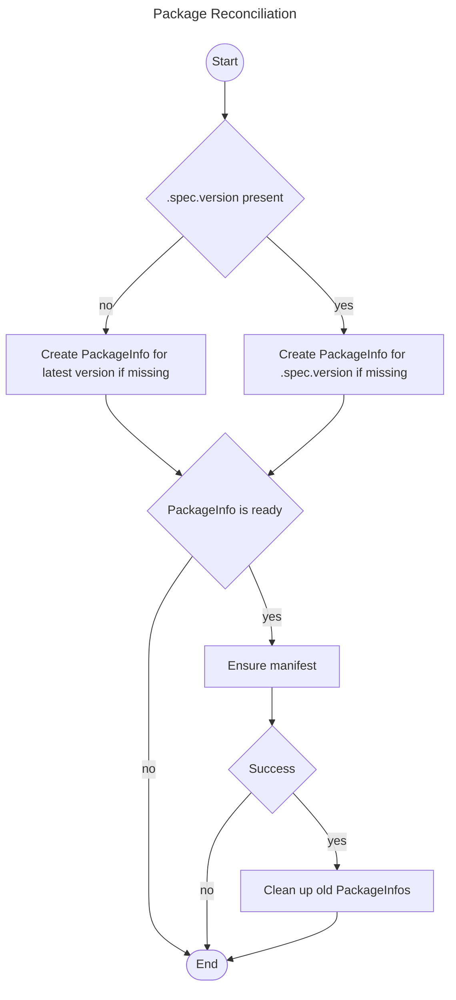
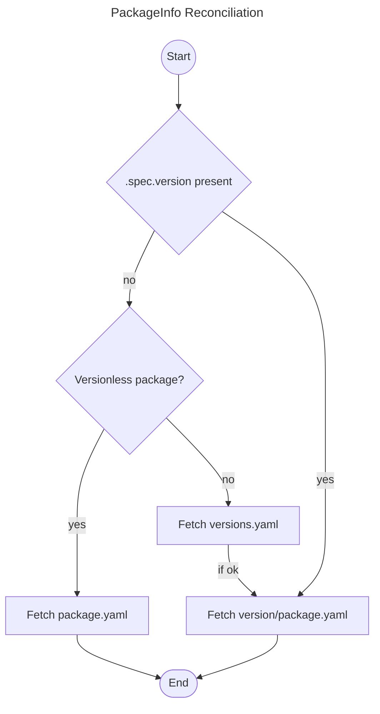

# Package Operator

The package operator follows the [Kubernetes Operator Pattern](https://kubernetes.io/docs/concepts/extend-kubernetes/operator/) and has two controllers:

## Package Controller

The Package controller manages the `Package` resources of the cluster. 

Whenever a `Package` has been created, changed or deleted these changes will be picked up and applied by the Package controller.

## PackageInfo Controller

The PackageInfo controller syncs the relevant `PackageInfo` resources with the manifests defined in the package repository.

## Handling Package Updates

A Package may have it's `.spec.version` set. 
This instructs the operator to install this exact version of the package. 
We also call this version pinning.
A Package's `.spec.version` may also be empty. 
In that case the operator will try to automatically update the package to it's latest version.

To update a package with a pinned version, run `glasskube update <package>`. 
This will upate the package to the latest version. 





### FAQ
**How is the latest version determined?**

The package's `versions.yaml` is fetched from the repository. This file contains all available versions.

**How is a specific version of a package fetched?**

Instead of fetching `repository.xyz/package-name/package.yaml`, the operator fetches `repository.xyz/package-name/version/package.yaml`

Check the [package repository documentation](../package-repository#structure) for more information.

## Dependency Management (WIP)

### Package Operator – reconciling package P depending on package D (P -> D):

#### Assumptions:
* Each involved referred package has status Ready, i.e. none of the referred packages are currently being deleted or updated, and their installation has not failed
* Each involved referred package has a `Spec.PackageInfo.Version` set, and it is equal to its `Status.Version`
* When the result of a situation is a dependency conflict, it might either be resolvable or not. Either way, the operator does not resolve such a conflict directly, but rather
the components interacting with the user (CLI, UI) need to guide them through potential resolution. Consequently, the only time the operator does resolve an unfulfilled
dependency, the "result" is denoted as `install`. 

```
if P requires no version range of D
  if D exists (trivially P -> D is fulfilled anyway)
    if no other package dependent on D
      * P -> D is fulfilled
    if other existing packages X, Y dependent on D
      if X and Y require no version range of D
        * P -> D is fulfilled
      if X requires D to be in version range XDV, or Y requires D to be in version range YDV
        * P -> D is fulfilled
  if D does not exist
    * install D pinned in latest(D)
if P requires D to be in version range PDV
  if D exists (let DV be the version of D)
    if no other existing package dependent on D requires a version range of D
      if DV inside PDV
        * P -> D is fulfilled
      if DV < PDV
        * P -> D not fulfilled – Dependency Conflict
        * resolvable by updating D to max_available(PDV)
      if DV > PDV
        * P -> D not fulfilled – Dependency Conflict
        * not resolvable because P does not support using D in DV yet
    if other existing packages X, Y dependent on D, with X requiring XDV, Y requiring YDV
      if DV inside PDV
        * P -> D is fulfilled
      if DV < PDV
        * P -> D not fulfilled – Dependency Conflict
        * might be resolvable if XDV, YDV and PDV overlap
      if DV > PDV
        * P -> D not fulfilled – Dependency Conflict
        * not resolvable because P does not support using D in DV yet
  if D does not exist
    * install D pinned in max_available(PDV)
```
