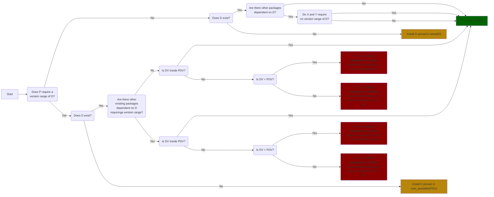

# Dependency Management

Dependency Management is a cross-cutting concern that is being handled in all glasskube components (GUI, CLI, Operator).
The following decision tree states how the Package Operator is handling dependencies.

## Package Operator – reconciling package P depending on package D (P -> D):

### Assumptions:
* Each involved referred package has status Ready, i.e. none of the referred packages are currently being deleted or updated, and their installation has not failed.
* Each involved referred package has a `Spec.PackageInfo.Version` set, and it is equal to its `Status.Version`.
* When the result of a situation is a dependency conflict, it might either be resolvable or not. Either way, the operator does not resolve such a conflict directly, but rather
  the components interacting with the user (CLI, UI) need to guide them through potential resolution. Consequently, the only time the operator does resolve an unfulfilled
  dependency, the "result" is denoted as `install`.

