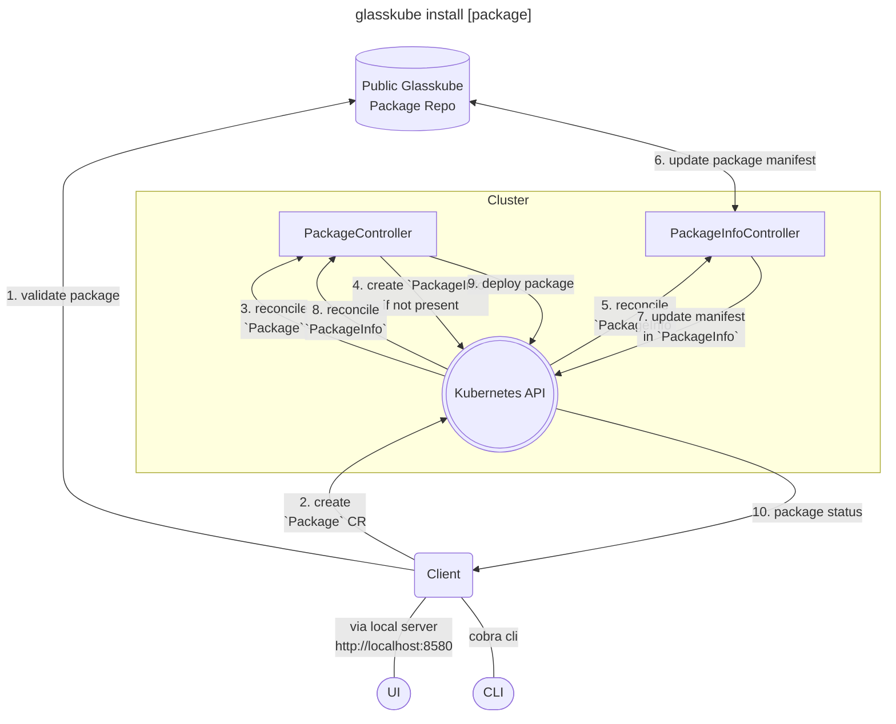

# Welcome

📦️ Glasskube will help you to **install your favorite Kubernetes packages**.

🤯 Using **traditional package managers** or applying manifests can be **super confusing**.

😍 Using the **Glasskube UI** for reduced complexity and increased transparency.

🧑‍💻 Still providing a **brew inspired CLI** for advanced users.

🏗️ Glasskube **packages are dependency aware**, as you would expect from a package manager.

🤖  Designed as a cloud native application, so you can follow your **GitOps approach**.


> Glasskube is an open-source Kubernetes package manager that simplifies package management for Kubernetes.


## Fast Track ⏱️ {#fast-track}

Install your first package in 5 minutes.


Install Glasskube via [Homebrew](https://brew.sh/):

```bash
brew tap glasskube/glasskube
brew install glasskube
```

Start the package manager:

```bash
glasskube serve
```

Open [`http://localhost:8580`](http://localhost:8580) and explore available packages.


For more installation options see the [Getting started](getting-started/install) section.

## Architecture 📏 {#architecture}

Glasskube uses multiple components, most notably a client and a package operator.

## Components

### Client

The client is an executable written in Go. It accepts user inputs via a UI and CLI.

They client creates packages in the form of Kubernetes Resources via the Kubernetes API.

### Package Operator

The package operator has two controllers:

1. The Package Controller (managing packages)
2. The PackageInfo Controller (syncing package infos from a repository)

### Packages Repository

A place where `PackageManifest`s are stored, searched and maintained.
Currently only the glasskube packages repository is supported: [`glasskube/packages`](https://github.com/glasskube/packages)

## Commands

For any command by default, the cluster given in `~/.kube/config` (`current-context`) will be used.
An alternative kube config can be passed with the `--kubeconfig` flag.

### `glasskube serve`

Will start the UI server and opens a local browser on [http://localhost:8580](http://localhost:8580).

### `glasskube bootstrap`

### `glasskube install <package>`

Installs the given package in your cluster.



### `glasskube uninstall <package>`

Removes the given package from your cluster.

### `glasskube search <name>`

### `glasskube ls`

Lists packages. Aliases are `glasskube l` and `glasskube list`. By default, all packages available in the configured repository are shown, including their installation status in the given cluster.

With the `--installed` flag you can restrict the list of packages to the once installed in your cluster.

### `glasskube --version`

Prints the client version.

### `glasskube version`

Prints the version of all components.
