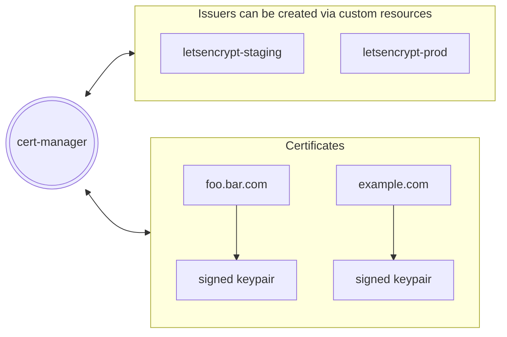

import Tabs from '@theme/Tabs';
import TabItem from '@theme/TabItem';
import Install from '../src/partials/_install.mdx';
import Discussion from '@site/src/components/GiscusWrapper';

# Install cert-manager for Kubernetes

Learn how to install [cert-manager](https://cert-manager.io/) using the [`glasskube`](https://github.com/glasskube/glasskube) package manager.

## Prerequisites

- Kubernetes cluster (You can easily create a local cluster by using [Minikube](https://minikube.sigs.k8s.io/docs/start/))
- [`kubectl`](https://kubernetes.io/docs/tasks/tools/) is strictly speaking no *dependency* for installing packages via glasskube,
but it is the recommended way to interact with the cluster. Therefore, it is highly recommended.
Installation instructions are available for
[macOS](https://kubernetes.io/docs/tasks/tools/install-kubectl-macos/),
[Linux](https://kubernetes.io/docs/tasks/tools/install-kubectl-linux/)
and [Windows](https://kubernetes.io/docs/tasks/tools/install-kubectl-windows/).

## About cert-manager

<br/>



<br/>

:::info

Cert-Manager is a widely used tool for managing certificates, specifically made for Kubernetes.
It simplifies the process of getting, renewing, and using SSL/TLS certificates.
Cert-Manager can interact with different certificate authorities (Issuer) such as Let's Encrypt,
and it can automatically issue valid certificates.
Additionally, it can handle the automatic renewal of certificates before they expire.

These certificates can then be used by various applications like ingress controllers or deployments.
:::


## Installation

Installing cert-manager can easily be achieved with the Glasskube package manager.

### Install Glasskube

If you already installed `glasskube` you can skip this step.
If not, `glasskube` can easily be installed the way you usually install packages for your operating system.

<Install/>

### Install cert-manager

<Tabs groupId="interface">
  <TabItem value="gui" label="GUI 🖥️">
    Start the UI via the command line:

    ```shell
    glasskube serve
    ```

    Install cert-manager via the Glasskube UI.
  </TabItem>
  <TabItem value="cli" label="CLI 🧑‍💻">
    A package can be installed with a simple command.

    ```shell
    glasskube install cert-manager
    ```

    The process will wait until the package got successfully installed.
  </TabItem>
</Tabs>

## Configuring cert-manager

Before cert-manager can issue certificates an `Issuer` or (`ClusterIssuer`) needs to be created so cert-manager knows which
certificate authority (CA) should sign the public key of the certificate.

In this example we showcase the use of the production acme server.
Fore testing purposes letsencrypt recommend the [staging environment](https://letsencrypt.org/docs/staging-environment/)
which has higher rate limits, than the production server.

```yaml title="cluster-issuer.yaml"
apiVersion: cert-manager.io/v1
kind: ClusterIssuer
metadata:
  name: letsencrypt
  namespace: cert-manager
spec:
  acme:
    server: https://acme-v02.api.letsencrypt.org/directory
    email: you@yourcorp.com # you will receive expiration warnings via this email
    privateKeySecretRef:
      name: letsencrypt
    solvers:
      - http01:
          ingress:
            class: nginx # requires ingress-nginx controller
```

The `ClusterIssuer` must be created as a Kubernetes custom resource. This can easily be achieved via `kubectl apply`:

```shell
kubectl apply -f cluster-issuer.yaml
```

Cert-manager creates an Ingress to validate the ACME challenge, if no Ingress controller is already installed in
the cluster the [ingress-nginx controller](./02_ingress-nginx.mdx) can easily be installed with Glasskube.

Further links about cert-manager:

 - Cert-manager docs: https://cert-manager.io/docs/
 - Issuer configuration: https://cert-manager.io/docs/configuration/
 - Issuer list: https://cert-manager.io/docs/configuration/issuers/

<Discussion category="Guides" categoryId="DIC_kwDOLDumD84CfK3R" />
