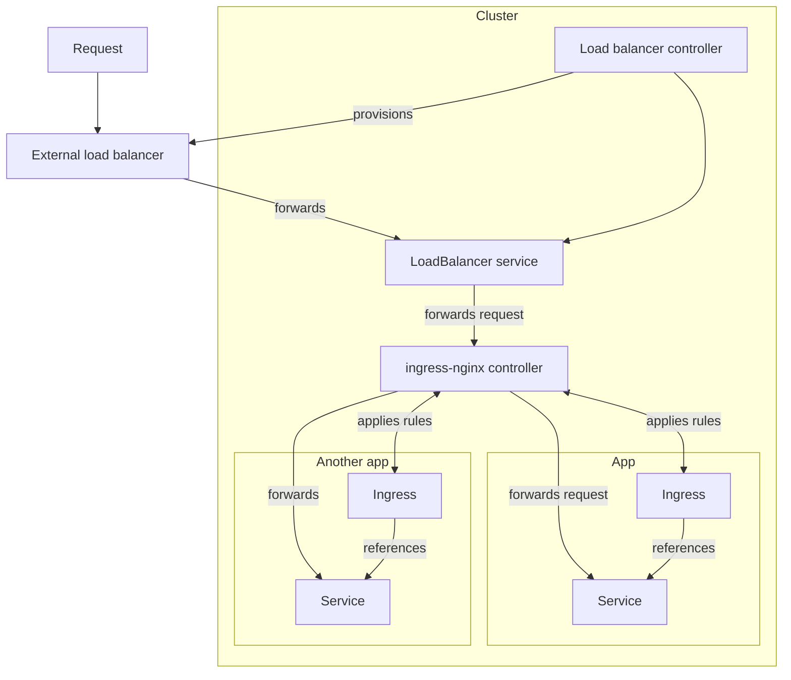

import Tabs from '@theme/Tabs';
import TabItem from '@theme/TabItem';
import Install from '../src/partials/_install.mdx';
import Discussion from '@site/src/components/GiscusWrapper';


# Install ingress-nginx for Kubernetes

Learn how to install [ingress-nginx](https://kubernetes.github.io/ingress-nginx/) using the [`glasskube`](https://github.com/glasskube/glasskube) package manager.

## Prerequisites

- Kubernetes cluster (You can easily create a local cluster by using [Minikube](https://minikube.sigs.k8s.io/docs/start/))
- [`kubectl`](https://kubernetes.io/docs/tasks/tools/) is *not* a dependency for installing packages via glasskube,
but it is the recommended way to interact with the cluster. We therefore recommend you install it regardless.
Installation instructions are available for
[macOS](https://kubernetes.io/docs/tasks/tools/install-kubectl-macos/),
[Linux](https://kubernetes.io/docs/tasks/tools/install-kubectl-linux/)
and [Windows](https://kubernetes.io/docs/tasks/tools/install-kubectl-windows/).

Additionally, because ingress-nginx works by running a NGINX in the cluster and exposing it via a LoadBalancer Service, which is handled by a different controller that is usually provisioned by your cloud provider.
If you run into issues installing ingress-nginx, please consult your cloud provider's documentation to learn how to create external load balancers for your cluster.

## About ingress-nginx

<br/>



<br/>

:::info
ingress-nginx is an Ingress controller for Kubernetes using [NGINX](https://nginx.org/) as a reverse proxy and load balancer.
:::

## Installation

Installing ingress-nginx can easily be achieved with the Glasskube package manager.

### Install Glasskube

If you already installed `glasskube` you can skip this step.
If not, `glasskube` can easily be installed the way you usually install packages for your operating system.

<Install />

### Install ingress-nginx

<Tabs groupId="interface">
  <TabItem value="gui" label="GUI 🖥️">
    Start the UI via the command line:

    ```shell
    glasskube serve
    ```

    Install ingress-nginx via the Glasskube UI.
  </TabItem>
  <TabItem value="cli" label="CLI 🧑‍💻">
    A package can be installed with a simple command.

    ```shell
    glasskube install ingress-nginx
    ```

    The process will wait until the package got successfully installed.
  </TabItem>
</Tabs>

## Using ingress-nginx

You can start using ingress-nginx straight away by creating an Ingress resource.
An Ingress is a specification that tells the ingress controller, in our case ingress-nginx, where to route a set of hosts and paths.
To learn more about creating Ingress resources, check out the [official documentation](https://kubernetes.io/docs/concepts/services-networking/ingress/).
Here is an example Ingress:

```yaml title="ingress.yaml"apiVersion: networking.k8s.io/v1
kind: Ingress
metadata:
  name: your-app
  namespace: default
  annotations:
    cert-manager.io/cluster-issuer: letsencrypt
spec:
  ingressClassName: nginx
  rules:
    - host: app.your-company.com
      http:
        paths:
          - pathType: Prefix
            path: /
            backend:
              service:
                name: your-app
                port:
                  name: http
  tls:
    - hosts:
        - app.your-company.com
      secretName: your-app-tls
```

This Ingress tells the controller that all traffic to the domain "app.your-company.com" with a path prefix of "/" should be routed to a Service in the same namespace named "your-app".
With the addition of a `cert-manager.io/cluster-issuer` annotation and `tls` block, it also instructs [cert-manager](https://cert-manager.io/) to issue a certificate for this domain name.
To learn more about cert-manager, check out [our guide on how to install cert-manager using Glasskube](./01_cert-manager.mdx).

Further links about ingress-nginx:

 - Ingress-nginx documentation: https://kubernetes.github.io/ingress-nginx/user-guide/nginx-configuration/
 - Ingress configuration: https://kubernetes.io/docs/concepts/services-networking/ingress/
 - Ingress controllers: https://kubernetes.io/docs/concepts/services-networking/ingress-controllers/

<Discussion category="Guides" categoryId="DIC_kwDOLDumD84CfK3R" />
