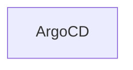

import Tabs from '@theme/Tabs';
import TabItem from '@theme/TabItem';
import Install from '../src/partials/_install.mdx';

# Using Glasskube in combination with ArgoCD

Learn how to use Glasskube Packages with the GitOps approach with [`glasskube`](https://github.com/glasskube/glasskube) package manager and [Argo CD](https://argoproj.github.io/cd/).

## Prerequisites

- Kubernetes cluster (You can easily create a local cluster by using [Minikube](https://minikube.sigs.k8s.io/docs/start/))
- [`kubectl`](https://kubernetes.io/docs/tasks/tools/) is *not* a dependency for installing packages via glasskube,
but it is the recommended way to interact with the cluster. We therefore recommend you install it regardless.
Installation instructions are available for
[macOS](https://kubernetes.io/docs/tasks/tools/install-kubectl-macos/),
[Linux](https://kubernetes.io/docs/tasks/tools/install-kubectl-linux/)
and [Windows](https://kubernetes.io/docs/tasks/tools/install-kubectl-windows/).


## About Argo CD

<br/>

TBD



<br/>

:::info
ingress-nginx is an Ingress controller for Kubernetes using [NGINX](https://nginx.org/) as a reverse proxy and load balancer.
:::

## Installation

Using the GitOps approach with Argo CD in combination with Glasskube requires an initial (manual) effort-

### Install Glasskube

If you already installed `glasskube` you can skip this step.
If not, `glasskube` can easily be installed the way you usually install packages for your operating system.

<Install />

### Install Argo CD

<Tabs groupId="interface">
  <TabItem value="gui" label="GUI 🖥️">
    Start the UI via the command line:

    ```shell
    glasskube serve
    ```

    Install Argo CD via the Glasskube UI.
  </TabItem>
  <TabItem value="cli" label="CLI 🧑‍💻">
    A package can be installed with a simple command.
    If Glasskube is not already bootstrapped there will be a prompt to bootstrap Glasskube during the installation
    of the first package.

    ```shell
    glasskube install argo-cd
    ```

    The process will wait until the package got successfully installed.
  </TabItem>
</Tabs>


In order to connect to Argo CD we need to:

1. Switch to argocd namespace with `kubectl config set-context --current --namespace=argocd`
2. Make sure you have the Argo CD cli installed. If not you can install it via `brew install argocd`
3. Create the initial Argo CD password with `argocd admin initial-password`


After the installation of Argo CD we can connect to the Argo CD UI with the `glasskube open` command or directly via the UI.

Now we are ready to install our first packages with the GitOps approach.


## Using Argo CD

We can now install a package e.g. the `kubernetes-dashboard`


```yaml title="package.yaml"
apiVersion: packages.glasskube.dev/v1alpha1
kind: Package
metadata:
  name: kubernetes-dashboard
spec:
  packageInfo:
    name: kubernetes-dashboard
    version: v2.7.0+2
```

There is also a demo repository where some of the packages are already installed.

You can find the url via: https://github.com/pmig/glasskube-argocd-packages

You can add these packages via:

`argocd app create keptn --repo https://github.com/pmig/glasskube-argocd-packages --path keptn --dest-server https://kubernetes.default.svc`

You can now watch the installed packages as seen in the screenshots
